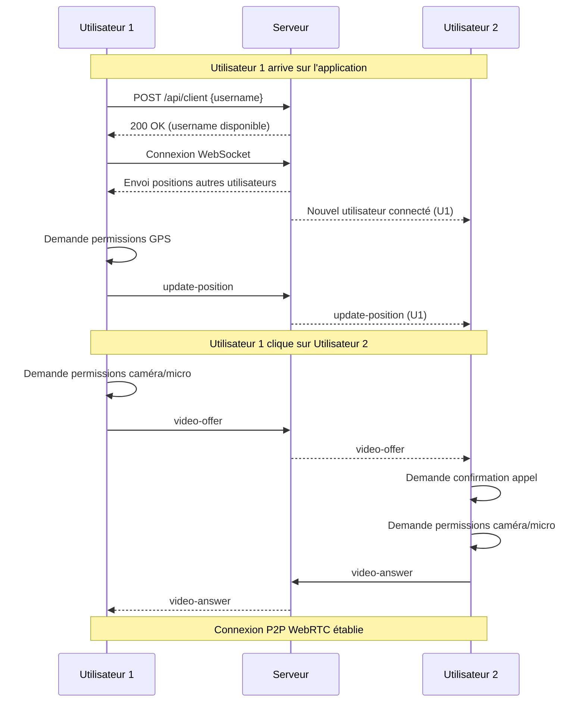
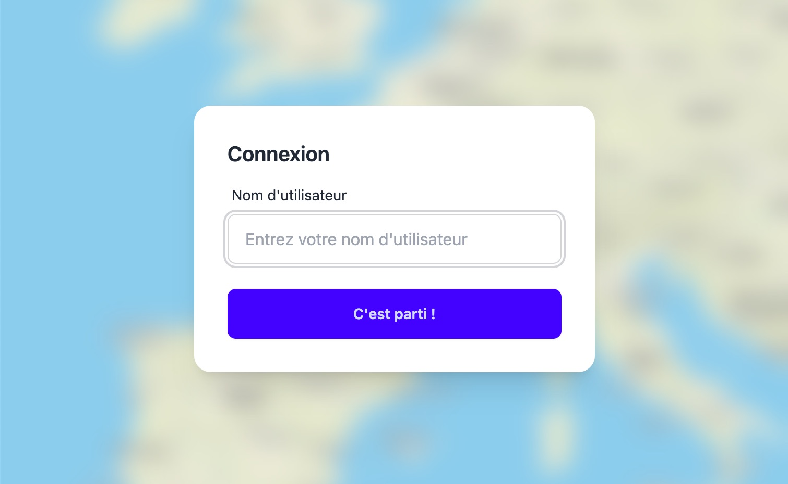
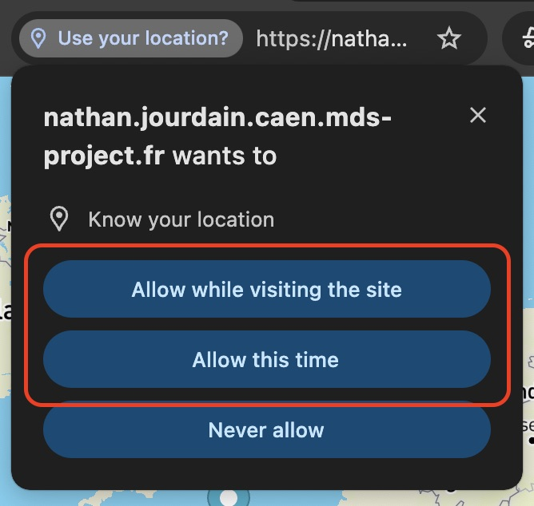
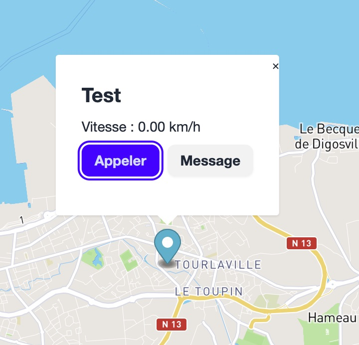
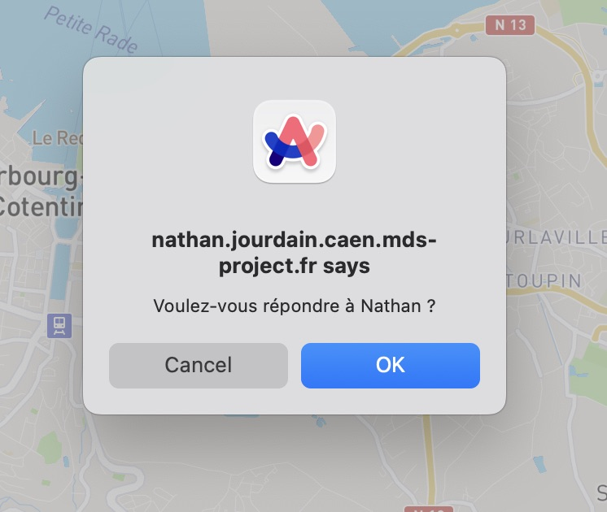
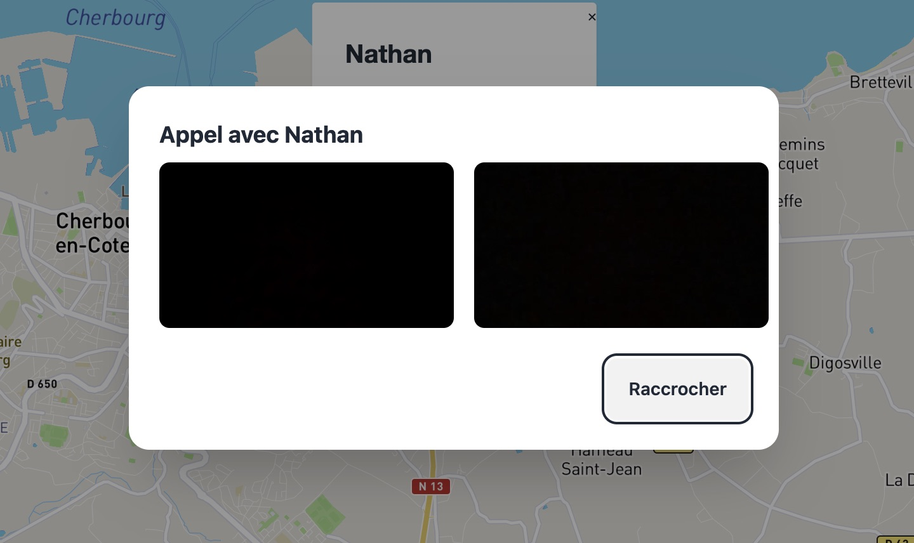

# GeoGlitch - Documentation

## Description
Cette application permet aux utilisateurs de partager leur position GPS en temps réel sur une carte interactive et d'établir des appels vidéo entre eux.

## Technologies utilisées
- **Frontend** :
  - HTML / JavaScript
  - [Mapbox GL JS](https://docs.mapbox.com/mapbox-gl-js/) pour la cartographie
  - [DaisyUI](https://daisyui.com/) & [TailwindCSS](https://tailwindcss.com/) pour le style
  - [WebRTC](https://developer.mozilla.org/en-US/docs/Web/API/WebRTC_API) pour les appels vidéos
  - [WebSocket](https://developer.mozilla.org/en-US/docs/Web/API/WebSocket) pour la communication en temps réel
  - [Geolocation API](https://developer.mozilla.org/en-US/docs/Web/API/Geolocation_API) pour la récupération de la position GPS
- **Backend** :
  - [Node.js](https://nodejs.org/)
  - [Express](https://expressjs.com/) pour le serveur HTTP et l'API
  - [ws](https://github.com/websockets/ws) pour le serveur WebSocket

## Structure du projet

```
.
├── frontend/
│   ├── assets/
│   ├── modules/
│   │   ├── config.js       # Configuration globale
│   │   ├── geolocation.js  # Gestion de la géolocalisation
│   │   ├── main.js         # Point d'entrée principal
│   │   ├── mapbox.js       # Gestion de la carte
│   │   ├── webrtc.js       # Gestion des appels vidéo
│   │   └── websocket.js    # Communication WebSocket
│   │   └── chat.js         # Gestion du chat
│   ├── index.html
│   └── script.js           # Import des modules
├── server.js               # Serveur Node.js
└── package.json
```

- **Frontend modulaire** : Organisation en modules pour une meilleure maintenabilité
- **WebRTC** : Utilisation de STUN pour la négociation des connexions P2P
- **WebSocket** : Gestion des événements et signalisation pour WebRTC
- **Express** : Serveur statique et API REST pour l'enregistrement des utilisateurs

#### Documentation technique


#### Parcours utilisateur
1. L'utilisateur arrive sur l'application et rentre un pseudo


2. L'utilisateur doit accepter les permissions pour la géolocalisation


3. L'utilisateur doit cliquer sur un autre utilisateur pour établir un appel vidéo ou lui envoyer un message


4. L'utilisateur cible doit accepter l'appel vidéo


5. Un des 2 utilisateurs peut stopper l'appel vidéo en cliquant sur "Raccrocher"


##### Les améliorations possibles
De nombreuses améliorations peuvent être apportées à l'application :
- Avoir un historique de discussion entre les utilisateurs
- Pouvoir couper le son, la caméra pendant un appel
- Pouvoir faire des appels de groupe
- Pouvoir partager son écran en plus de la caméra
- Avoir des données persistantes pour les utilisateurs (base de données) et pouvoir voir la dernière position des utilisateurs même quand ils ne sont pas connectés


### Autres précisions
Lorsque qu'un utilisateur ferme sa fenêtre, ou a une coupure réseau, le serveur WebSocket prévient les autres utilisateurs pour supprimer son point sur la map et fermé les visioconférences en cours avec cet utilisateur.

Chaque utilisateur à un nom d'utilisateur qui permet d'identifier ses informations dans un objet global stocké sur le serveur (pas de base de données). Dès qu'un utilisateur se connecte, il est ajouté à cet objet global. Lorsqu'il se déconnecte, il est supprimé de cet objet global. Dans cet objet on stocke les informations suivantes : 
- Son nom d'utilisateur
- Sa connexion websocket en cours
- Sa position GPS
- Ses autres informations (accéléromètre, vitesse de déplacement, etc.)

Ces informations permettent d'envoyer les utilisateurs connectés à un nouvel utilisateur qui vient de se connecter, pour qu'il puisse les afficher sur la map sans devoir attendre que chaque utilisateur renvoie ses informations.

Pour récupérer la position de l'utilisateur nous utilisons la méthode watchPosition de l'API de géolocalisation du navigateur ce qui nous permet d'obtenir la position de l'utilisateur dès que celui ci se déplace. On peut également récupérer sa vitesse de déplacement.


## Dépendances
La map est réalisé avec `Mapbox` qui est une librairie JavaScript pour afficher des cartes basée sur OpenStreetMap.
Elle nécessite un token pour fonctionner que vous pouvez obtenir en vous inscrivant sur le site de Mapbox. On a le droit à 50 000 chargement de la map par mois gratuitement ce qui est largement suffisant dans notre cas.

➡️ Obtenir une clé API : [https://docs.mapbox.com/help/getting-started/access-tokens/](https://docs.mapbox.com/help/getting-started/access-tokens/)


## Installation
1. Cloner le dépôt :
```bash
git clone <repository-url>
cd <project-folder>
```

2. Installer les dépendances :
```bash
npm install
```

3. Configurer les variables dans `public/modules/config.js` :
- `MAPBOX_ACCESS_TOKEN` : Votre token Mapbox
- `WEB_SOCKET_URL` : URL du serveur WebSocket


4. Démarrer le serveur :
```bash
node server.js
```

5. Ouvrir l'application dans un navigateur :
```bash
http://localhost:8080
```

## Déploiment VPS
Suivre la [documentation](./doc//deploy-vps.md)


## Éléments requis
- L'application nécessite un navigateur moderne supportant WebRTC
- L'autorisation d'accès à la caméra/micro est requise pour les appels
- La géolocalisation doit être activée pour le partage de position
- Pas d'authentification forte implémentée, uniquement un pseudo utilisateur est demandé lors de l'arrivée sur l'application
- Pas de persistance des données utilisateurs, dès qu'un utilisateur quitte l'application, ses données sont supprimées
- Le site doit être en HTTPS pour que la géolocalisation et l'accès à la caméra/micro fonctionnent correctement (sauf en localhost)

## Tester plus facilement la position GPS
Pour tester plus facilement la position GPS, vous pouvez modifier votre position dans le navigateur. Sur Chrome : 
- Ouvrir les outils de développement
- Aller dans l'onglet `Sensors`
- Modifier la position GPS


## Démo
https://github.com/user-attachments/assets/d5511b1e-468a-4a43-9c92-e3fb5202864e

